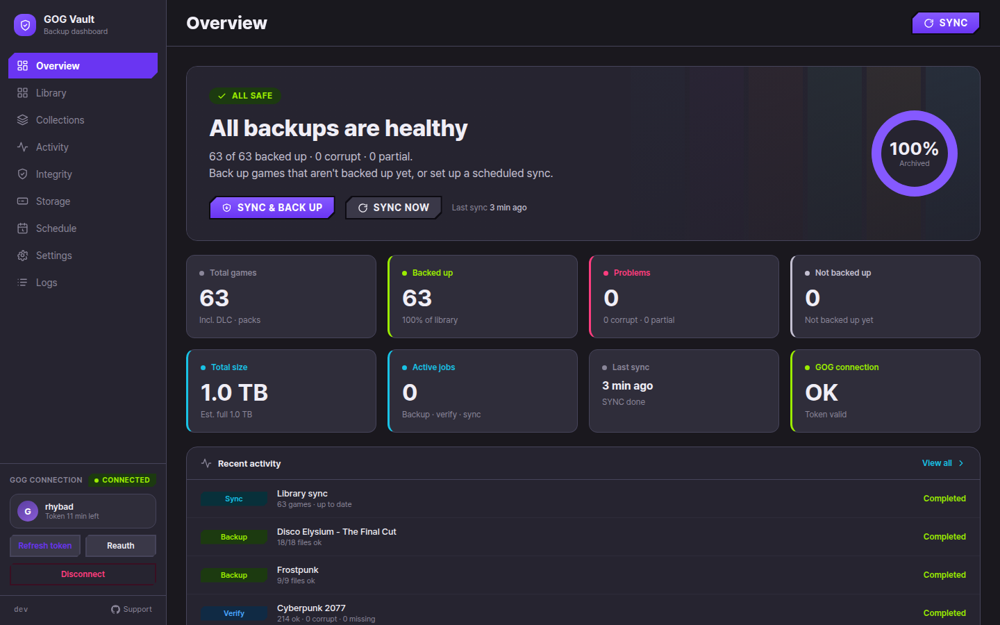
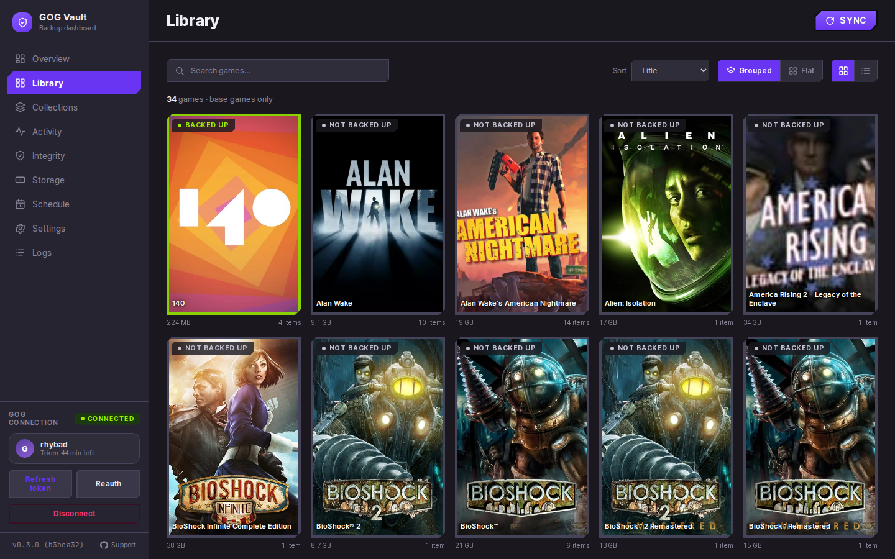
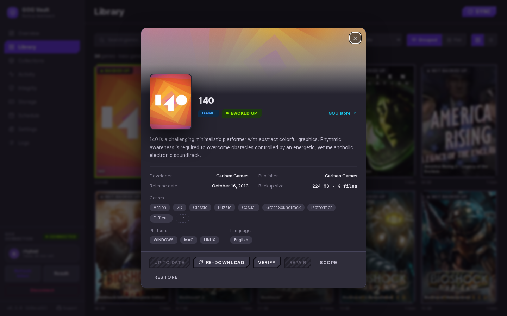
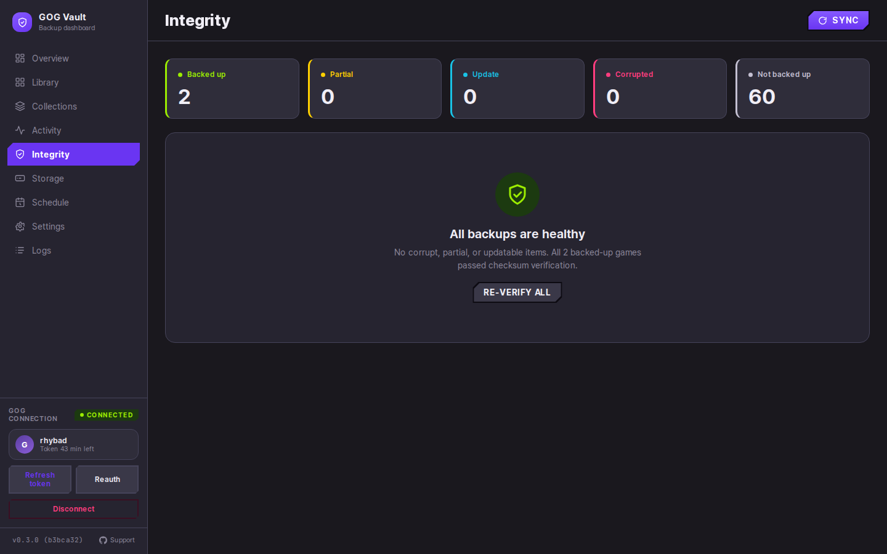

# GOG Vault

**Self-hosted dashboard to back up, verify, restore, and auto-sync your own GOG library** — built for
an always-on home server or NAS. Point it at your GOG account and it keeps a clean, checksum-verified
local archive of the DRM-free installers and bonus content **you already own**.

[](LICENSE)
[](https://github.com/rhybad/gog-vault/releases)
[](https://github.com/rhybad?tab=packages&repo_name=gog-vault)
[](https://github.com/rhybad/gog-vault/discussions)

> **It runs in Docker. If you can paste two commands and edit a text file, you can run it.**
> Jump to **[Quick start](#-quick-start)**.

> ⚠️ **Beta / pre-release (v0.x).** GOG Vault is usable and actively developed, but still early and moving
> fast — expect occasional rough edges. In particular, **updates may include one-way database
> migrations**, so **back up your database volume and your archive before every update**, and consider
> pinning `GV_VERSION` to a known-good release rather than tracking `latest`. See
> **[Updating](docs/updating.md)**.

---

## 📸 Screenshots

A Plex-style dashboard for your GOG library — a safety-first home page, a cover-art grid with
backup-status badges, a game-detail view with nested DLC/extras, and an Integrity (verify/repair)
screen. It's fully responsive, so it works on phones and tablets too.

|                       **Overview** — Sync & back up                       |              **Library** — a Plex-style grid               |
| :-----------------------------------------------------------------------: | :-------------------------------------------------------: |
| [](screenshots/overview.png)         | [](screenshots/library.png) |
|                   **Game detail** — DLC, extras & actions                  |              **Integrity** — verify & repair              |
| [](screenshots/game-detail.png) | [](screenshots/integrity.png) |

<sub>Click any shot to open it full size.</sub>

---

## ✨ What it does

- **Library sync** — your owned games, DLC, and packs, Plex-style (grouped or flat), with cover art.
- **Backup & update detection** — download your installers; get told when GOG has a newer build.
- **One-click "Sync & back up"** — from the Overview, sync and then back up everything that needs it in
  one go, after a confirm showing the size and game count; watch (or stop) it live in Activity.
- **Built-in download manager** — watch every backup download live in an Activity **Queue**, see what's
  waiting, follow per-game progress on each cover, and **stop a whole scheduled run** in one click.
  Optionally **back up several games in parallel** (Settings → General; default 1).
- **Integrity verify + repair** — checksums your archive and re-fetches anything corrupt or missing.
- **Restore helper** — stream any archived file back out when you need it.
- **Scheduler & notifications** — automatic syncs/backups, with webhook alerts.
- **Image archival** — caches each game's art locally so the UI keeps working through GOG CDN changes.
- **Make it yours** — pick from 7 UI **themes** (a flat _Classic_ plus six chamfered palettes) and an
  optional **custom background image**, under Settings.
- **Responsive UI**, **English & Korean**, switchable in Settings.

---

## ⚠️ Please read first — what this is (and isn't)

GOG Vault is a **personal hobby project**, built and maintained by one person in their spare time and
shared in case it's useful to other GOG collectors. A few honest expectations so nobody's surprised:

- **It's pre-release (v0.x) and evolving.** Features and the database schema still change between
  versions, and updates can carry **one-way migrations** — back up before upgrading (see
  [`docs/updating.md`](docs/updating.md)), and pin a version if you want stability.
- **No warranty, no SLA, no support desk.** It's offered as-is under Apache-2.0. You run it at your own
  discretion. (See [`SECURITY.md`](SECURITY.md) for how to report security issues.)
- **It was built largely through "vibe coding"** — fast, iterative development with heavy help from AI
  coding agents, rather than a team following a long, traditional QA process. In practice that means:
  - it covers a lot and moves quickly, but it **hasn't been hardened across every environment**;
  - when something breaks, **diagnosing it can take a while** — there isn't deep, hand-written knowledge
    of every corner of the code, so reproducible bug reports matter a lot;
  - **some issues may stay open or get closed** if they can't be reproduced or are out of scope for a
    hobby effort. That's not dismissiveness — it's one person's bandwidth.
- **Treat your backups as one copy, not the only copy.** This tool _helps_ you keep a local archive; it
  is **not** a guaranteed backup system. Follow the [3-2-1 rule](https://www.backblaze.com/blog/the-3-2-1-backup-strategy/)
  for anything you can't afford to lose.

Bug reports and ideas are genuinely welcome — just calibrate expectations on response time and on whether
every issue gets fixed. See **[Contributing & feedback](#-contributing--feedback)**.

### Legal / affiliation

GOG Vault backs up **games you own** for your own personal archival. It is **not a launcher and performs
no DRM circumvention**. It is an **independent project, not affiliated with or endorsed by GOG sp. z o.o.**;
"GOG" and "GOG Galaxy" are trademarks of their respective owners. Versions GOG has already removed from
your account cannot be recovered.

---

## 🚀 Quick start

**You need:** an always-on machine (NAS, home server, mini-PC, VPS), **Docker + Docker Compose v2**
(`docker compose`, not the old `docker-compose`), and disk space for your library. Images are multi-arch
(**amd64** and **arm64** — Raspberry Pi 4/5, Apple-silicon hosts, etc.).

```bash
# 1. Make a folder and grab the two config files
mkdir gog-vault && cd gog-vault
curl -O https://raw.githubusercontent.com/rhybad/gog-vault/main/docker-compose.yml
curl -O https://raw.githubusercontent.com/rhybad/gog-vault/main/.env.example

# 2. Create the data folders the stack bind-mounts, so they're yours (not root-owned by Docker)
mkdir -p archive db

# 3. Create your .env and set the two REQUIRED values
cp .env.example .env
#   POSTGRES_PASSWORD  = any strong value
#   APP_ENCRYPTION_KEY = run:  openssl rand -base64 32   and paste the output

# 4. Start it
docker compose up -d
```

Then open **`http://<your-host>:8080`**, click **Connect GOG**, and start a sync. First boot pulls the
images and sets up the database automatically — give it a minute.

👉 New to this? The **[Getting Started walkthrough](docs/getting-started.md)** explains every step,
including installing Docker.

---

## 📚 Documentation

| Guide                                              | What's in it                                              |
| -------------------------------------------------- | --------------------------------------------------------- |
| **[Getting Started](docs/getting-started.md)**     | Install Docker → run the stack → connect GOG → first sync |
| **[Using the dashboard](docs/usage.md)**           | Sync, back up, verify/repair, restore, schedule, notify   |
| **[Configuration](docs/configuration.md)**         | Every `.env` setting explained                            |
| **[Updating](docs/updating.md)**                   | Pull new versions safely; pin a release                   |
| **[Reverse proxy & HTTPS](docs/reverse-proxy.md)** | Put it behind Caddy / Traefik / nginx (SSE notes)         |
| **[Troubleshooting](docs/troubleshooting.md)**     | The usual first-run snags and fixes                       |

---

## ⚙️ Configuration at a glance

Only **two** values are required; everything else has a sane default. Full reference:
[`docs/configuration.md`](docs/configuration.md).

| Variable             | Required |   Default   | What it does                                                   |
| -------------------- | :------: | :---------: | ------------------------------------------------------------- |
| `POSTGRES_PASSWORD`  | **yes**  |      —      | Database password (internal to the stack).                    |
| `APP_ENCRYPTION_KEY` | **yes**  |      —      | Base64 32-byte key encrypting your GOG tokens at rest.        |
| `ARCHIVE_HOST_PATH`  |    no    | `./archive` | Where your backups + art are written — point at a big disk.   |
| `DB_HOST_PATH`       |    no    |   `./db`    | Host path for the PostgreSQL data dir — small but precious.    |
| `WEB_PORT`           |    no    |   `8080`    | Host port for the web UI.                                     |
| `TZ`                 |    no    |    `UTC`    | Timezone schedule cron times run in — set e.g. `Asia/Seoul`.  |
| `GV_VERSION`         |    no    |  `latest`   | Pin a release (e.g. `v0.7.0`) or track `latest`.              |

---

## 💾 Your data

- **Game backups + archived art** → `ARCHIVE_HOST_PATH` (default `./archive`). This is the data you care
  about — keep it on storage you control and back it up like any other archive.
- **Database** → `DB_HOST_PATH` (default `./db`) on the host — it holds your library metadata and your
  **encrypted** GOG tokens (AES-256-GCM with your `APP_ENCRYPTION_KEY`). Small but precious; back it up.
- **Redis** → a Docker named volume (transient queue/progress state).

Only the web UI port is published; the database, Redis, and API stay on the internal Docker network.

---

## 🔄 Updating

```bash
docker compose pull && docker compose up -d
```

Schema migrations apply automatically on boot. Prefer deliberate upgrades? Pin `GV_VERSION` to a release
tag in `.env`. Details: [`docs/updating.md`](docs/updating.md).

---

## 💬 Contributing & feedback

There's no code to contribute here — **the application source is private**, and this repository is the
public home for the prebuilt images, docs, and your feedback. What helps most:

- 🐛 **Bug report** → [open an issue](https://github.com/rhybad/gog-vault/issues/new/choose) (please read
  [Troubleshooting](docs/troubleshooting.md) first and include your version + logs).
- 💡 **Feature idea** → [open an issue](https://github.com/rhybad/gog-vault/issues/new/choose) or start an
  [Idea discussion](https://github.com/rhybad/gog-vault/discussions).
- 💬 **Question / help** → [Discussions](https://github.com/rhybad/gog-vault/discussions).

See [`CONTRIBUTING.md`](CONTRIBUTING.md) for what makes a report actionable (and the hobby-project caveats).

---

## 📄 License

[Apache-2.0](LICENSE) © Rhythmical Badass. GOG Vault is an independent project, not affiliated with
GOG sp. z o.o. See [`NOTICE`](NOTICE).
